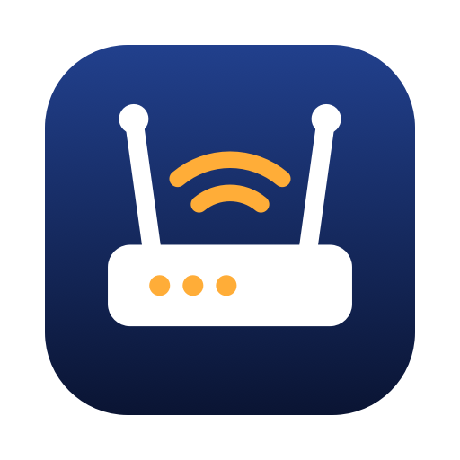

<p align="center">
  
</p>

<h1 align="center">WiFi or ISP</h1>

<p align="center">Is your slow internet your Wi-Fi or your ISP? A free, source-available menu bar app for macOS that tells you.</p>

<p align="center">
  <a href="https://wifiorisp.com">wifiorisp.com</a> ·
  <a href="https://github.com/coreyhaines31/wifiorisp/releases/latest">Download</a> ·
  <a href="https://github.com/coreyhaines31/wifiorisp/issues">Issues</a>
</p>

---

When the internet feels slow, WiFi or ISP measures both sides of the line at the same moment: the round trip to your router, and the round trip past it to the internet. If the router answers fast and the internet doesn't, it's your ISP. If even the router is slow, it's your Wi-Fi or router. The menu bar icon fills with your Wi-Fi signal and names the slow side when there is one, like **ISP**.

## Features

- **The verdict** — "Slow: ISP, not WiFi", "Slow: weak WiFi signal", "Slow: WiFi or router, not ISP", "Offline: ISP is down, WiFi is fine", explained in plain words (Excellent, Fast, Slow), with the raw numbers (dBm, noise, band, link rate) a glance away.
- **Flight recorder** — logs signal, noise, transmit rate, roaming, router and internet latency, and drops in the background. A timeline shows the last hour to 30 days.
- **A report for your ISP** — a plain-text summary of outages and slowdowns, including whether your router kept answering during each outage (which puts it on their side). Or export everything as CSV.
- **Alerts** — when the internet drops (and comes back), when your Mac falls back to 2.4 GHz, or when it roams to a weaker access point.
- **Speed test** — on demand, against [M-Lab](https://www.measurementlab.net) (NDT7). M-Lab publishes every result as open data, and the app tells you that before your first test.
- **Lag under load** — the IETF [responsiveness test](https://datatracker.ietf.org/doc/draft-ietf-ippm-responsiveness/) (RPM), with router probes during the test to show whether the queue is on your side or past your router.
- **No telemetry.** History stays on your Mac. Nothing is sent anywhere except the tests you start.

## How it measures

Every 5 to 30 seconds, the app times a TCP handshake to your router and, at the same moment, to 1.1.1.1 and 8.8.8.8. A handshake is exactly one round trip, and it needs no special privileges (no ICMP). Wi-Fi details come from CoreWLAN. The app never scans for networks, and it backs off when CoreWLAN stops answering, so it can't add to an `airportd` request storm.

macOS only shows apps the Wi-Fi network name with Location access. WiFi or ISP never reads your location, and everything works without the permission. Your network just shows as "Unknown network".

## Install

**Download** the latest DMG from [Releases](https://github.com/coreyhaines31/wifiorisp/releases/latest) and drag WiFi or ISP to Applications. The app is signed and notarized, and updates itself.

**Homebrew:**

```sh
brew install --cask coreyhaines31/tap/wifiorisp
```

Requires macOS 14 Sonoma or later.

## Building from source

Requires Xcode 16+ and [XcodeGen](https://github.com/yonaskolb/XcodeGen).

```sh
brew install xcodegen swiftlint
xcodegen generate          # creates WiFiOrISP.xcodeproj from project.yml
open WiFiOrISP.xcodeproj
```

Or from the command line:

```sh
xcodebuild -project WiFiOrISP.xcodeproj -scheme WiFiOrISP test
swiftlint --strict
```

The measuring, verdict, logging, report, and test logic lives in `Packages/WiFiOrISPCore` with unit tests. `swift run wifiorisp-cli [samples|speed|rpm|report]` in that folder runs the probes and tests from a terminal.

## License

WiFi or ISP is source available under the [Functional Source License, Version 1.1, MIT Future License](LICENSE) (FSL-1.1-MIT): use it, change it, and run it for anything except a competing product. Each version becomes MIT two years after it's released. The name and icon are covered by the [trademark policy](TRADEMARK.md).
